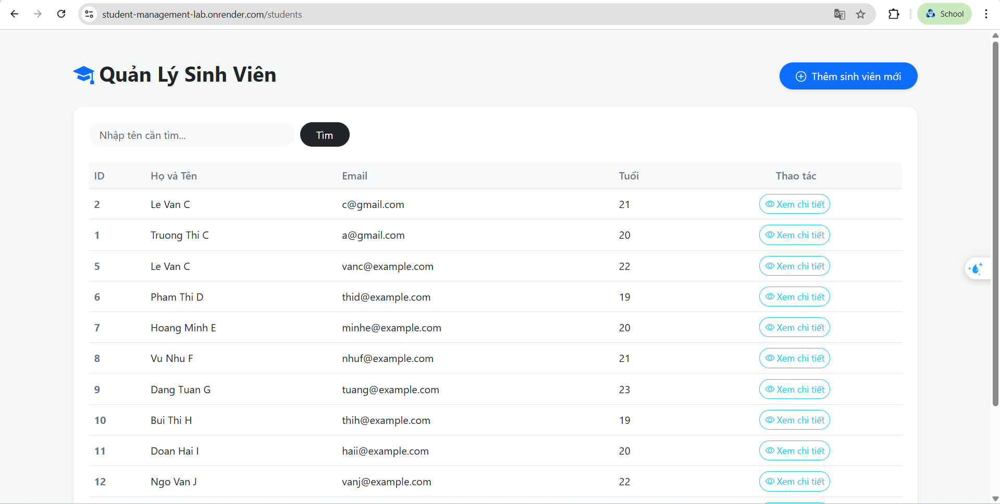
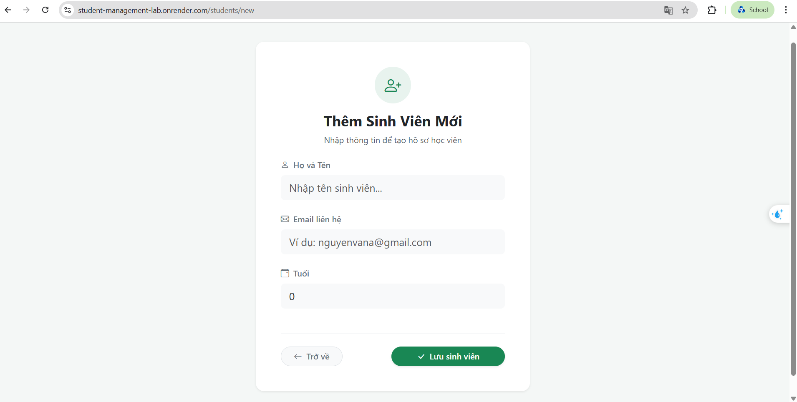
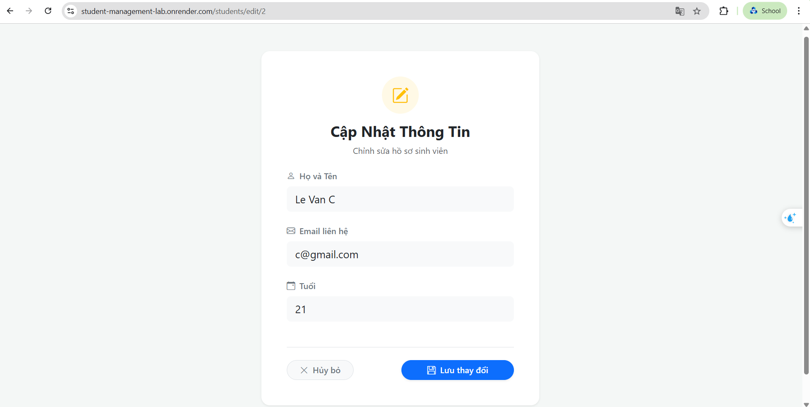

# Student Management System

## Danh sách nhóm
* Trương Thanh Nhân - MSSV: 2312453

## Public URL của Web Service (Lab 5)
* https://student-management-lab.onrender.com/students

## Hướng dẫn cách chạy dự án (Local)
1. Đảm bảo máy tính đã cài đặt Java 17 (hoặc 21) và cấu hình đúng `JAVA_HOME`.
2. Mở Terminal tại thư mục gốc của dự án.
3. Chạy lệnh sau để khởi động ứng dụng:
   ```bash
   ./mvnw spring-boot:run
4. Ứng dụng sẽ chạy tại: http://localhost:8080

## Trả lời các câu hỏi lý thuyết
### Lab 01
1. Hãy thử thêm ít nhất 10 sinh viên nữa
* INSERT INTO students (id, name, email, age) VALUES (3, 'Le Van C', 'vanc@example.com', 22);
* INSERT INTO students (id, name, email, age) VALUES (4, 'Pham Thi D', 'thid@example.com', 19);
* INSERT INTO students (id, name, email, age) VALUES (5, 'Hoang Minh E', 'minhe@example.com', 20);
* INSERT INTO students (id, name, email, age) VALUES (6, 'Vu Nhu F', 'nhuf@example.com', 21);
* INSERT INTO students (id, name, email, age) VALUES (7, 'Dang Tuan G', 'tuang@example.com', 23);
* INSERT INTO students (id, name, email, age) VALUES (8, 'Bui Thi H', 'thih@example.com', 19);
* INSERT INTO students (id, name, email, age) VALUES (9, 'Doan Hai I', 'haii@example.com', 20);
* INSERT INTO students (id, name, email, age) VALUES (10, 'Ngo Van J', 'vanj@example.com', 22);
* INSERT INTO students (id, name, email, age) VALUES (11, 'Truong Kien K', 'kienk@example.com', 21);
* INSERT INTO students (id, name, email, age) VALUES (12, 'Ly Thi L', 'thil@example.com', 20);

2. Ràng buộc Khóa Chính (Primary Key)
* INSERT INTO students (id, name, email, age) VALUES (3, 'Le Van M', 'vanc@example.com', 22);
* Database chặn vì id là khóa chính nên không thể trùng nhau

3. Toàn vẹn dữ liệu (Constraints)
* Data không báo lỗi vì tên không được khai báo là NOT NULL. Khi java đọc dữ liệu sẽ có những hàng chứa dữ liệu rác (tên để trống)

4. Cấu hình Hibernate
* Mỗi lần tắt ứng dụng và chạy lại, dữ liệu cũ trong Database bị mất sạch là do dòng cấu hình `spring.jpa.hibernate.ddl-auto=create` nằm trong file `application.properties
* Giá trị `create` ra lệnh cho Hibernate rằng mỗi khi khởi động server, nó phải tự động xóa bỏ (DROP) các bảng cũ và khởi tạo lại (CREATE) các bảng mới tinh dựa trên cấu trúc mã nguồn. Thiết lập này giúp môi trường dev luôn sạch sẽ, nhưng khi triển khai thực tế (production), bắt buộc phải đổi cấu hình này thành `update` hoặc `none` để bảo vệ dữ liệu


## Screenshot cho các module trong Lab 4

### Danh sách các module cần chụp ảnh:

#### 1. Trang Danh sách sinh viên
- **URL**: `https://student-management-lab.onrender.com/students`
- **Mô tả**: Hiển thị tất cả sinh viên với các trường: ID, Họ và Tên, Email, Tuổi
- **Chức năng**: Có nút "Thêm sinh viên mới", nút "Xem chi tiết" cho mỗi sinh viên


#### 2. Trang Chi tiết sinh viên
- **URL**: `https://student-management-lab.onrender.com/students/{id}` (ví dụ: `/students/1`)
- **Mô tả**: Hiển thị thông tin chi tiết của một sinh viên
- **Chức năng**: Xem thông tin, có các nút "Sửa" và "Xóa"


#### 3. Trang Thêm sinh viên mới
- **URL**: `https://student-management-lab.onrender.com/students/new`
- **Mô tả**: Form nhập thông tin sinh viên mới
- **Chức năng**: Nhập Name, Email, Age và lưu vào database



#### 4. Trang Chỉnh sửa sinh viên
- **URL**: `http://localhost:8080/students/edit/{id}` (ví dụ: `/students/edit/1`)
- **Mô tả**: Form chỉnh sửa thông tin sinh viên
- **Chức năng**: Cập nhật thông tin sinh viên đã có


